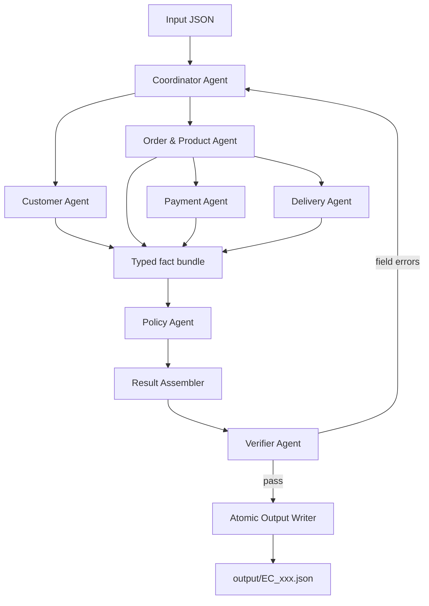
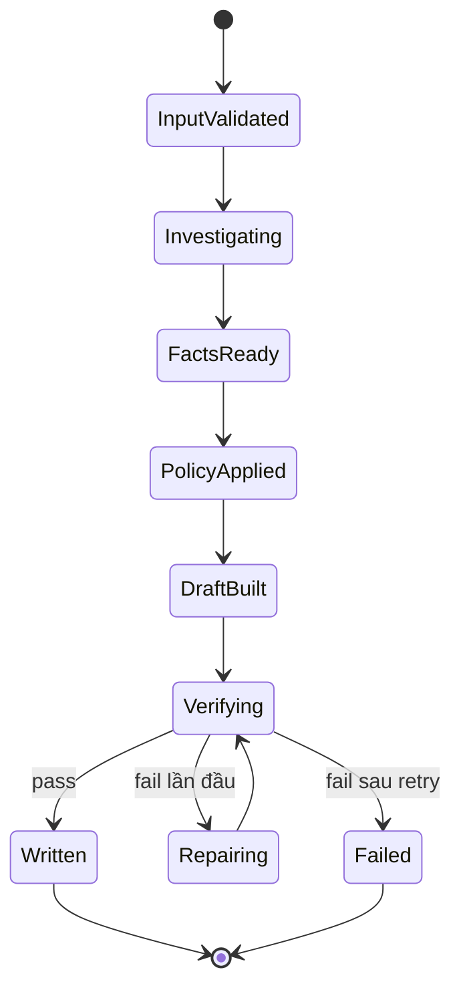

# Architecture — Multi-Agent E-commerce Dispute Resolution

## 1. Mục tiêu kiến trúc

Hệ thống điều tra 50 khiếu nại thương mại điện tử dựa trên dữ liệu Olist và xuất đúng 50 tệp JSON theo `EC_POLICY_V2`.

Kiến trúc được tối ưu theo bốn ưu tiên:

1. **Đúng dữ liệu:** mọi kết luận phải truy ngược được tới CSV hoặc policy.
2. **Đúng nghiệp vụ:** áp dụng primary issue theo đúng thứ tự ưu tiên, không để mô hình tự suy diễn luật.
3. **Có multi-agent thực chất:** mỗi agent sở hữu một domain, có quyền truy cập và hợp đồng handoff riêng.
4. **Ổn định khi chấm tự động:** output có thứ tự xác định, số liệu làm tròn nhất quán, được kiểm tra trước khi ghi file.

Đây là kiến trúc **deterministic-first, agent-orchestrated**. Agent điều phối quản lý luồng; các specialist agent điều tra từng domain; các phép join, tính tiền, tính thời gian, phân loại policy và kiểm tra schema được thực hiện bằng code xác định. Nếu dùng LLM, LLM chỉ được gọi tool và trả dữ liệu có cấu trúc, không được tự tạo fact, ID hoặc số tiền.

## 2. Quyết định kiến trúc chính

| Quyết định | Lựa chọn | Lý do |
| --- | --- | --- |
| Kiểu điều phối | Đồ thị trạng thái cố định | Cả 50 case có cùng schema và cùng quy trình; không cần LLM tự chọn luồng |
| Kiểu triển khai | Một tiến trình Python, nhiều agent/node | Dữ liệu Olist nhỏ, tránh microservice và đồng bộ mạng không cần thiết |
| Truy cập dữ liệu | `OlistRepository` chỉ đọc, nạp và lập chỉ mục một lần | Join nhanh, thống nhất cách xử lý null và thứ tự dòng |
| Tính toán | Tool Python dùng `Decimal` và `datetime` | Loại bỏ lỗi số thực và hallucination |
| Policy | Rule engine phiên bản hóa `EC_POLICY_V2` | Bảo đảm đúng thứ tự ưu tiên và tái lập kết quả |
| Handoff | Object có schema, không truyền văn bản tự do | Agent sau không phải đoán ý agent trước |
| Kiểm chứng | Verifier độc lập + Pydantic/JSON Schema | Chặn sai ID, sai số tiền, sai null, vượt giới hạn mảng |
| Ghi output | Chỉ ghi sau khi verify; ghi nguyên tử | Không để lại file JSON dở hoặc file không hợp lệ |
| LLM | Không tham gia phép tính quyết định | Dữ liệu và policy đều có cấu trúc; LLM không tạo thêm độ chính xác |

Không cần message broker, database server hoặc microservice cho quy mô 50 case và bộ CSV tĩnh của bài toán này.

## 3. Sơ đồ tổng thể



Luồng được chia thành ba tầng:

- **Investigation:** Customer, Order & Product, Payment và Delivery thu thập fact trong phạm vi riêng.
- **Decision:** Policy Agent áp dụng `EC_POLICY_V2` lên fact đã khóa.
- **Assurance:** Result Assembler dựng JSON; Verifier kiểm tra độc lập; Output Writer mới được quyền ghi file.

## 4. Thành phần và trách nhiệm

### 4.1 Coordinator Agent

**Trách nhiệm**

- Đọc và kiểm tra input case.
- Xác nhận `policy_version = EC_POLICY_V2`.
- Tạo `InvestigationTask` dùng chung cho các agent.
- Kích hoạt các nhánh theo dependency của dữ liệu.
- Thu kết quả, phát hiện agent thất bại hoặc thiếu handoff.
- Gửi `FactBundle` bất biến cho Policy Agent.
- Khi Verifier báo lỗi, chuyển lỗi về đúng agent sở hữu field và chỉ retry tối đa một lần.
- Ghi trace cho mọi lần dispatch, handoff, retry và hoàn thành.

**Không được làm**

- Không tự tính refund, thời gian giao hàng hoặc đối soát payment.
- Không tự sửa kết quả chuyên môn của specialist agent.
- Không ghi trực tiếp vào `output/`.

### 4.2 Customer Agent

**Nguồn đọc:** `orders`, `customers`.

**Đầu ra**

- `customer_unique_id` của order đang điều tra.
- Danh sách order khác của cùng `customer_unique_id`.
- Cờ `repeat_customer` dựa trên toàn bộ lịch sử trước khi giới hạn output.

**Quy tắc**

- Loại `claimed_order_id` khỏi `related_order_ids`.
- Không đưa order lịch sử vào `affected_entities.order_ids`.
- Giữ thứ tự ổn định theo thứ tự nguồn; output tối đa 5 related order.
- Nếu `include_customer_history = false`, trả mảng lịch sử rỗng và không gắn `repeat_customer`.

### 4.3 Order & Product Agent

**Nguồn đọc:** `orders`, `order_items`, `products`, `sellers`.

**Đầu ra**

- Order status và các timestamp cần thiết.
- Item, seller, product, category của order.
- `item_total_brl`, `freight_total_brl`.
- Với từng seller: `shipping_limit_at` sớm nhất trong các item của seller đó.
- Các cờ `multi_item_order`, `multi_seller_order`, `multiple_categories` dựa trên toàn bộ row trước khi truncate.
- `OrderFinancialBasis` cho Payment Agent.
- `DeliveryBasis` cho Delivery Agent.

**Quy tắc**

- Item giữ thứ tự row nguồn; seller, product và category được distinct theo lần xuất hiện đầu tiên.
- Một order có nhiều row của cùng seller thì chỉ tạo một seller handoff record, dùng `shipping_limit_date` sớm nhất của seller đó.
- Khi không có item row: các mảng item/seller/product/category rỗng; các tổng tiền item/freight và các trường reconciliation phụ thuộc item phải là `null`.
- `order_reviews`, `geolocation` và dữ liệu không được policy sử dụng không tham gia kết luận.

### 4.4 Payment Agent

**Nguồn đọc:** `order_payments`.

**Handoff nhận:** `OrderFinancialBasis` từ Order & Product Agent.

**Đầu ra**

- Payment IDs theo `payment_sequential`.
- Tổng payment và danh sách payment type ổn định.
- `expected_total_brl`, `difference_brl`, `reconciled`.
- Cờ `split_payment` dựa trên số payment row thực tế.

**Công thức**

```text
expected_total_brl = item_total_brl + freight_total_brl
difference_brl     = payment_total_brl - expected_total_brl
reconciled         = abs(difference_brl) <= 0.10
```

Mọi giá trị tiền dùng `Decimal`, làm tròn hai chữ số bằng một hàm duy nhất trước khi so sánh và serialize. `payment_value` được cộng theo từng row, không nhân với `payment_installments`.

Nếu không có item row, `expected_total_brl`, `difference_brl` và `reconciled` phải là `null`, dù order có payment.

### 4.5 Delivery Agent

**Handoff nhận:** `DeliveryBasis` từ Order & Product Agent.

**Đầu ra**

- `delivered_at`, `estimated_delivery_at`, `carrier_handoff_at`.
- `delivery_variance_hours`.
- Phân tích handoff riêng cho từng seller.
- `late_handoff_seller_ids`.

**Công thức**

```text
delivery_variance_hours
  = order_delivered_customer_date - order_estimated_delivery_date

handoff_variance_hours của seller
  = order_delivered_carrier_date - shipping_limit_date sớm nhất của seller
```

Giá trị giờ được tính từ timestamp gốc, không đổi múi giờ, rồi làm tròn hai chữ số. Một seller bị giao muộn khi `handoff_variance_hours > 0`. Một order giao muộn khi `delivery_variance_hours > 0`.

Timestamp bị thiếu làm cho phép tính tương ứng là `null`; agent không tự điền thời gian hoặc tracking checkpoint không có trong dữ liệu.

### 4.6 Policy Agent

**Nguồn đọc:** chỉ `FactBundle` và module policy `EC_POLICY_V2`; không truy cập CSV.

**Trách nhiệm**

- Chọn đúng một primary issue theo thứ tự ưu tiên.
- Sinh secondary issues theo đúng thứ tự quy định.
- Xác định root cause, responsible parties, refund và resolution actions.
- Không tạo evidence ID; chỉ chỉ ra các fact cần được dẫn chứng.

**Thứ tự primary issue bắt buộc**

```text
1. canceled_order_paid
2. unavailable_order_paid
3. late_delivery_seller
4. late_delivery_logistics
5. valid_split_payment
6. unsupported_late_claim
```

Policy engine đánh giá lần lượt và dừng ở rule đầu tiên khớp. Nếu không rule nào khớp, case nhận lỗi nội bộ `UNCLASSIFIED_CASE`; hệ thống không được tự phát minh taxonomy mới.

**Thứ tự secondary issue bắt buộc**

```text
multi_item_order
multi_seller_order
split_payment
repeat_customer
multiple_categories
```

**Thứ tự action**

1. Action chính của primary issue.
2. `review_seller_handoff` hoặc `review_carrier_delay` khi phù hợp.
3. `verify_refund_completion` với `canceled_order_paid` hoặc `unavailable_order_paid`, do dataset không có refund ledger để xác nhận tiền đã được hoàn.
4. `coordinate_multi_seller_case` khi có nhiều seller.
5. `verify_payment_allocation` khi split payment, trừ primary issue `valid_split_payment`.

Refund được lấy từ fact đã tính:

- `canceled_order_paid`, `unavailable_order_paid`: tổng payment.
- `late_delivery_seller`, `late_delivery_logistics`: tổng freight.
- Các trường hợp còn lại: `0.00`.

`case_status = action_required` khi refund lớn hơn 0; ngược lại là `no_action`.

### 4.7 Result Assembler

Result Assembler là thành phần xác định, không dùng LLM. Thành phần này:

- Ghép các specialist result và policy decision vào đúng output schema.
- Sinh `affected_entities`, context, analysis và evidence ID.
- Áp dụng giới hạn mảng sau khi toàn bộ phép phân tích đã hoàn tất.
- Giữ thứ tự nguồn và thứ tự nghiệp vụ.
- Tạo confidence theo quy tắc tái lập được.

**Confidence đề xuất**

```text
confidence = max(0.50, 1.00 - 0.05 × số cảnh báo dữ liệu không quyết định)
```

Một case khớp rule, đủ fact quyết định và qua toàn bộ kiểm tra có confidence `1.00`. Lỗi thiếu fact quyết định không được che bằng confidence thấp; case phải fail verification.

### 4.8 Verifier Agent

Verifier dùng implementation kiểm tra độc lập và quyền đọc dữ liệu nguồn. Verifier không thay đổi candidate output; nó trả `ValidationReport` có đường dẫn field, mã lỗi và agent chịu trách nhiệm.

Verifier kiểm tra:

- Case ID khớp input và tên file.
- Primary issue khớp rule có ưu tiên cao nhất.
- Secondary issues và actions đúng thứ tự, không trùng.
- Status, responsible parties, root cause và refund nhất quán.
- Toàn bộ phép cộng tiền và số giờ đúng hai chữ số.
- Trường phụ thuộc item là `null` khi order không có item.
- Không có order lịch sử trong `affected_entities`.
- Evidence ID đúng định dạng và tồn tại thật trong CSV/policy.
- Mọi array không vượt giới hạn.
- Timestamp giữ nguyên định dạng nguồn hoặc `null`.
- Không có `NaN`, `Infinity`, key lạ hoặc key bắt buộc bị thiếu.

Verifier chỉ trả `pass` khi không còn lỗi. Warning không quyết định có thể được giữ để tính confidence và ghi trace.

### 4.9 Atomic Output Writer

- Là thành phần duy nhất có quyền ghi vào `output/`.
- Chỉ nhận candidate đã có `verification.status = passed`.
- Ghi vào file tạm cùng thư mục, flush rồi đổi tên nguyên tử thành `EC_xxx.json`.
- JSON dùng UTF-8, không `NaN`, số tiền và giờ tối đa hai chữ số thập phân.
- Không tạo log, file tạm hoặc manifest bên trong `output/`.

## 5. Quyền truy cập

| Thành phần | Dữ liệu được đọc | State được ghi | Quyền ghi file |
| --- | --- | --- | --- |
| Coordinator | Input, trạng thái agent | Điều phối, lỗi, retry | Không |
| Customer Agent | `orders`, `customers` | `customer_result` | Không |
| Order & Product Agent | `orders`, `order_items`, `products`, `sellers` | `order_product_result` | Không |
| Payment Agent | `order_payments`, `OrderFinancialBasis` | `payment_result` | Không |
| Delivery Agent | `DeliveryBasis` | `delivery_result` | Không |
| Policy Agent | `FactBundle`, `EC_POLICY_V2` | `policy_result` | Không |
| Result Assembler | Các result đã khóa | `candidate_output` | Không |
| Verifier Agent | Candidate, input, CSV và policy chỉ đọc | `validation_report` | Không |
| Output Writer | Candidate đã pass | Không | Chỉ `output/*.json` |
| Trace Sink | Event đã lọc | Không | Chỉ `trace.jsonl` |

Các agent không gọi trực tiếp lẫn nhau. Mọi handoff đi qua graph state do Coordinator quản lý; nhờ đó trace thể hiện rõ agent nào tạo fact nào và agent nào tiêu thụ fact đó.

## 6. Hợp đồng handoff nội bộ

### 6.1 Envelope chung

```json
{
  "schema_version": "1.0",
  "case_id": "EC_001",
  "producer": "payment_agent",
  "status": "success",
  "data": {},
  "warnings": [],
  "errors": []
}
```

Mỗi agent chỉ được ghi vào namespace của mình. `data` được validate bằng schema riêng trước khi handoff.

### 6.2 InvestigationTask

```json
{
  "case_id": "EC_001",
  "claimed_order_id": "<olist_order_id>",
  "investigation_scope": {
    "include_customer_history": true,
    "include_product_context": true
  },
  "policy_version": "EC_POLICY_V2"
}
```

### 6.3 Handoff phụ thuộc

| Producer | Consumer | Nội dung tối thiểu |
| --- | --- | --- |
| Coordinator | Tất cả specialist | `InvestigationTask` |
| Order & Product | Payment | Item tồn tại hay không, item total, freight total |
| Order & Product | Delivery | Ba timestamp giao hàng và shipping limit sớm nhất theo seller |
| Bốn specialist | Policy | `FactBundle` đã validate và khóa |
| Policy + specialist | Result Assembler | Facts, decision, danh sách entity nguồn |
| Result Assembler | Verifier | Candidate output đầy đủ |
| Verifier | Coordinator | Field errors và owner để retry |
| Verifier | Output Writer | Candidate + xác nhận `passed` |

## 7. Trạng thái case và luồng thực thi



### Trình tự một case

1. Coordinator validate input và order ID.
2. Customer Agent và Order & Product Agent có thể chạy song song.
3. Khi Order & Product hoàn tất, Payment Agent và Delivery Agent chạy song song trên handoff tương ứng.
4. Coordinator chờ đủ bốn specialist result.
5. FactBundle được validate rồi đóng băng.
6. Policy Agent áp dụng rule theo thứ tự.
7. Result Assembler dựng candidate JSON.
8. Verifier kiểm tra schema, công thức, source evidence và invariant.
9. Nếu pass, Output Writer ghi file. Nếu fail lần đầu, Coordinator gửi lỗi về owner, dựng lại candidate và verify lại.
10. Nếu vẫn fail, toàn batch dừng trước bước đóng gói để tránh nộp kết quả sai âm thầm.

## 8. Data Access Layer

`OlistRepository` nạp các CSV một lần khi khởi động và cung cấp các hàm query có kiểu dữ liệu rõ ràng:

```text
get_order(order_id)
get_items(order_id)
get_payments(order_id)
get_customer_for_order(order_id)
get_orders_by_customer_unique_id(customer_unique_id)
get_products(product_ids)
get_sellers(seller_ids)
evidence_exists(evidence_id)
```

### Chỉ mục nạp sẵn

- `orders_by_order_id`
- `items_by_order_id`
- `payments_by_order_id`
- `customer_by_customer_id`
- `orders_by_customer_unique_id`
- `product_by_product_id`
- `seller_by_seller_id`

Các list giữ thêm `source_row_number` để bảo toàn thứ tự CSV. Distinct list dùng quy tắc “lần xuất hiện đầu tiên”, không dùng `set` không có thứ tự.

`order_reviews` và `geolocation` có thể được kiểm tra khi nạp dữ liệu nhưng không được dùng để suy ra giao sai, giao thiếu, refund ledger hoặc tracking checkpoint vì dataset không cung cấp các bằng chứng này.

## 9. Quy tắc số học, thời gian và null

- Tiền: đọc từ chuỗi sang `Decimal`, không dùng `float` cho phép cộng.
- Làm tròn: một helper dùng thống nhất `ROUND_HALF_UP` tới `0.01`.
- Reconciliation: so sánh `abs(difference_brl) <= Decimal("0.10")`.
- Thời gian: parse timestamp dạng naive, không chuyển timezone.
- Số giờ: lấy tổng số giây chia `Decimal("3600")`, rồi làm tròn hai chữ số.
- Timestamp output: giữ đúng `YYYY-MM-DD HH:MM:SS` hoặc `null`.
- Không item: các mảng item/seller/product/category/handoff rỗng; expected total, difference và reconciled là `null`.
- Không có timestamp đầu vào cần thiết: variance tương ứng là `null`; không suy diễn.

## 10. Tạo ID, giới hạn và thứ tự

### Evidence ID hợp lệ

```text
order:<order_id>
item:<order_id>:<order_item_id>
payment:<order_id>:<payment_sequential>
seller:<seller_id>
policy:<root_cause_code>
```

Assembler sinh ID từ record nguồn, tuyệt đối không nhận ID do LLM viết tự do. Verifier parse từng ID và kiểm tra sự tồn tại.

### Thứ tự evidence

1. Order đang điều tra.
2. Toàn bộ item theo thứ tự nguồn.
3. Toàn bộ payment theo thứ tự nguồn.
4. Seller chịu trách nhiệm theo thứ tự xuất hiện.
5. Policy của root cause hạng 1.

Thông thường danh sách trên nằm dưới giới hạn 20. Nếu số candidate vượt 20, Assembler phải luôn giữ order, các responsible seller và policy; các slot còn lại dành cho item và payment theo thứ tự nguồn. Việc giới hạn evidence độc lập với giới hạn của `affected_entities`, vì evidence phải phản ánh các row thực sự được dùng để kết luận.

### Giới hạn output

| Trường | Tối đa | Quy tắc chọn |
| --- | ---: | --- |
| Order ID | 5 | Chỉ claimed order; không thêm lịch sử |
| Item ID | 5 | Thứ tự nguồn |
| Seller ID | 3 | Lần xuất hiện đầu tiên |
| Payment ID | 5 | Thứ tự nguồn/payment sequential |
| Related order ID | 5 | Thứ tự nguồn, loại claimed order |
| Product ID | 5 | Lần xuất hiện đầu tiên |
| Category | 5 | Lần xuất hiện đầu tiên |
| Root cause | 3 | Thứ tự rank |
| Responsible party | 3 | Thứ tự policy rồi thứ tự nguồn |
| Evidence | 20 | Thứ tự evidence ở trên |
| Action | 5 | Thứ tự policy |

Mọi cờ phân tích như multi-item, multi-seller hoặc multiple-category phải được tính trên dữ liệu đầy đủ **trước khi** giới hạn mảng output.

## 11. Xử lý lỗi và retry

| Lỗi | Owner | Cách xử lý |
| --- | --- | --- |
| Input sai schema/tên case | Coordinator | Dừng case, không suy đoán giá trị |
| Không tìm thấy claimed order | Order & Product | Trả lỗi dữ liệu; batch không được đóng gói |
| Specialist timeout/exception | Agent tương ứng | Retry một lần với cùng input |
| Sai phép tính tiền | Payment | Tính lại từ row nguồn |
| Sai variance/handoff | Delivery | Tính lại từ timestamp nguồn |
| Sai rule/thứ tự issue/action | Policy | Chạy lại rule engine |
| Evidence không tồn tại | Assembler/agent sở hữu entity | Dựng lại từ source record |
| Candidate sai schema/limit/null | Assembler | Dựng lại, không vá JSON bằng chuỗi |
| Fail sau một lần repair | Coordinator | Đánh dấu batch failed và báo rõ case |

Không bỏ qua lỗi để vẫn tạo đủ 50 file. Chỉ bắt đầu đóng gói khi preflight xác nhận toàn bộ 50 case hợp lệ.

## 12. Xử lý batch và hiệu năng

- Nạp dữ liệu và lập chỉ mục đúng một lần cho toàn bộ run.
- Xử lý nhiều case với giới hạn concurrency cấu hình được, đề xuất 4 case đồng thời.
- Trong một case, chỉ chạy song song các agent không phụ thuộc nhau.
- Không gửi CSV hoặc toàn bộ lịch sử vào prompt; agent chỉ nhận task và fact tối thiểu.
- Nếu dùng model local, dùng chung một model dưới hoặc bằng 10B và giới hạn số request đồng thời theo VRAM.
- Trace được ghi qua một queue/sink duy nhất để tránh các dòng JSONL xen vào nhau.
- Output của từng case được ghi nguyên tử; thứ tự hoàn thành case không ảnh hưởng tên file hay nội dung.

## 13. Trace và khả năng kiểm toán

`trace.jsonl` được mở ở chế độ ghi mới ở đầu mỗi run, không append lịch sử cũ. Mỗi dòng là một event JSON:

```json
{
  "run_id": "20260805T070000Z",
  "case_id": "EC_001",
  "agent": "delivery_agent",
  "event": "handoff_completed",
  "status": "success",
  "input_from": "order_product_agent",
  "output_to": "coordinator_agent",
  "duration_ms": 12,
  "retry": 0,
  "facts": {
    "delivery_variance_hours": 87.39,
    "late_handoff_seller_count": 1
  }
}
```

Trace cần chứng minh được:

- Coordinator đã giao việc cho các agent khác nhau.
- Mỗi specialist tạo output domain riêng.
- Có handoff phụ thuộc Order & Product → Payment/Delivery.
- Policy chỉ chạy sau khi facts sẵn sàng.
- Verifier thực sự kiểm tra candidate trước khi Writer ghi file.

Không ghi API key, secret, prompt chứa dữ liệu không cần thiết hoặc toàn bộ row nhạy cảm vào trace.

## 14. Cấu trúc source đề xuất

```text
.
├── architecture.md
├── metadata.json
├── trace.jsonl
├── individual_5SoCuoiMHV_HoVaTen.md
├── data/
├── input/
├── output/
├── src/
│   ├── main.py
│   ├── graph.py
│   ├── state.py
│   ├── agents/
│   │   ├── coordinator.py
│   │   ├── customer.py
│   │   ├── order_product.py
│   │   ├── payment.py
│   │   ├── delivery.py
│   │   ├── policy.py
│   │   └── verifier.py
│   ├── policies/
│   │   └── ec_policy_v2.py
│   ├── repositories/
│   │   └── olist_repository.py
│   ├── schemas/
│   │   ├── input.py
│   │   ├── handoff.py
│   │   └── output.py
│   ├── tools/
│   │   ├── money.py
│   │   ├── delivery.py
│   │   └── evidence.py
│   ├── assembler.py
│   ├── writer.py
│   └── trace.py
└── tests/
    ├── test_policy_priority.py
    ├── test_money_reconciliation.py
    ├── test_delivery_analysis.py
    ├── test_null_handling.py
    ├── test_evidence.py
    └── test_output_schema.py
```

## 15. Framework và model

### Framework đề xuất

- **Python 3.11+** cho toàn bộ pipeline.
- **LangGraph StateGraph** hoặc graph executor tương đương để biểu diễn node, dependency, fan-out/fan-in và retry.
- **Pydantic v2** cho input, handoff, state và output schema.
- **pandas/Polars hoặc DuckDB** cho việc nạp và join CSV; chỉ chọn một phương án trong implementation.
- **pytest** cho rule, công thức và invariant.

### Quy tắc dùng model

- Mọi model phải nhỏ hơn hoặc bằng 10B parameters.
- `MODEL_NAME` và parameter size được khai báo rõ trong source code và `metadata.json`.
- API key/secret chỉ đặt trong `.env`; `.env` không được commit.
- Dùng temperature thấp/0 và structured output nếu agent có gọi model.
- Model không được nhận quyền ghi file, truy cập CSV tùy ý hoặc tạo evidence ID.
- Kết quả tool là nguồn sự thật; text do model sinh không được ghi thẳng vào final JSON.

Vì output hoàn toàn có cấu trúc và policy đã xác định, triển khai tối ưu có thể không cần LLM ở đường quyết định. Nếu framework/rubric yêu cầu LLM-backed agent, model chỉ làm tool selection trong whitelist; mọi số liệu và kết luận cuối vẫn do deterministic tool tạo và Verifier kiểm tra.

## 16. Kiểm thử bắt buộc

### Unit test

- Sáu primary rule và thứ tự ưu tiên giữa chúng.
- Secondary issue đúng thứ tự.
- `difference_brl` tại biên `-0.10`, `0.10`, `-0.11`, `0.11`.
- Giao đúng giờ, giao trễ; handoff đúng giờ, trễ; nhiều seller.
- Canceled/unavailable có payment.
- Order không item nhưng có/không payment.
- Split payment hợp lệ và không hợp lệ.
- Item/payment/evidence ID và giới hạn mảng.

### Invariant test

- `recommended_refund_brl > 0` khi và chỉ khi `case_status = action_required`.
- `late_delivery_seller` luôn có ít nhất một late seller và seller responsible.
- `late_delivery_logistics` không có late seller.
- `valid_split_payment` có ít nhất hai payment row, reconciled và không có `verify_payment_allocation`.
- `unsupported_late_claim` có delivery variance `<= 0` và payment reconciled.
- Root cause hạng 1 khớp primary issue.
- Mọi evidence ID đều tồn tại.

## 17. Preflight trước khi nộp

Preflight phải chạy sau khi xử lý xong và trước khi zip:

1. `output/` chứa đúng 50 file.
2. Tên file đúng từ `EC_001.json` đến `EC_050.json`, không thiếu và không có file lạ.
3. Mỗi file parse được bằng strict JSON và validate đúng output schema.
4. `case_id` khớp tên file và input tương ứng.
5. Mọi cross-field invariant, phép tính, evidence và giới hạn đều pass.
6. Không có file tạm, log, `.env`, source code hoặc audit file trong `output/`.
7. `trace.jsonl` là trace của lượt chạy mới nhất và có event hoàn thành cho đủ 50 case.
8. `metadata.json` ghi đúng model, parameter size, framework và runtime thực tế.
9. Toàn bộ source, `architecture.md`, báo cáo cá nhân, trace và metadata đã được commit vào repo.
10. Chỉ nén nội dung của `output/` để nộp chấm điểm.

## 18. Tóm tắt luồng tin cậy

```text
CSV fact
→ domain tool tính toán
→ specialist agent handoff fact có schema
→ policy engine quyết định theo thứ tự cố định
→ assembler dựng output
→ verifier đối chiếu lại CSV + policy + schema
→ writer ghi JSON đã pass
```

Kiến trúc này bảo toàn yêu cầu multi-agent nhưng đặt tính đúng đắn vào các thành phần có thể kiểm thử và tái lập. Nhờ vậy, hệ thống vừa thể hiện rõ phân công, handoff và kiểm chứng giữa agent, vừa giảm tối đa lỗi hallucination, sai số tiền, sai evidence và sai schema trong 50 case chấm tự động.
