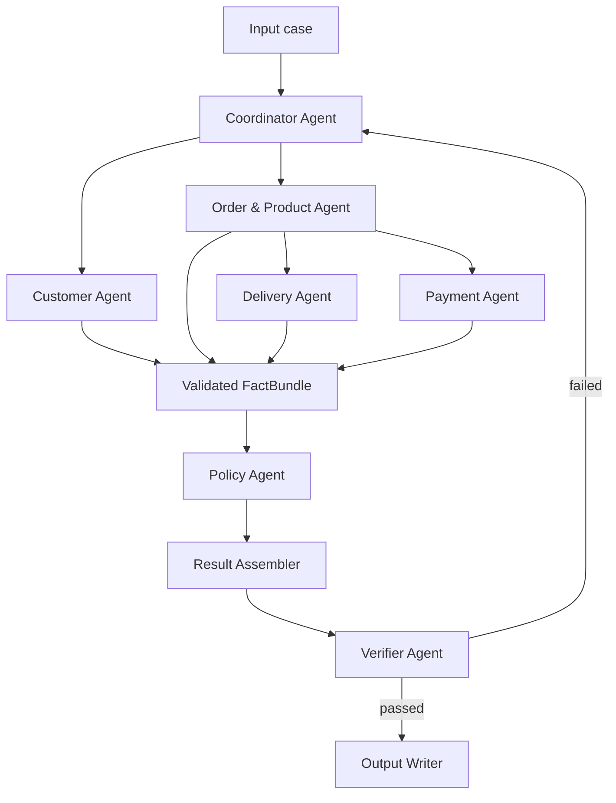
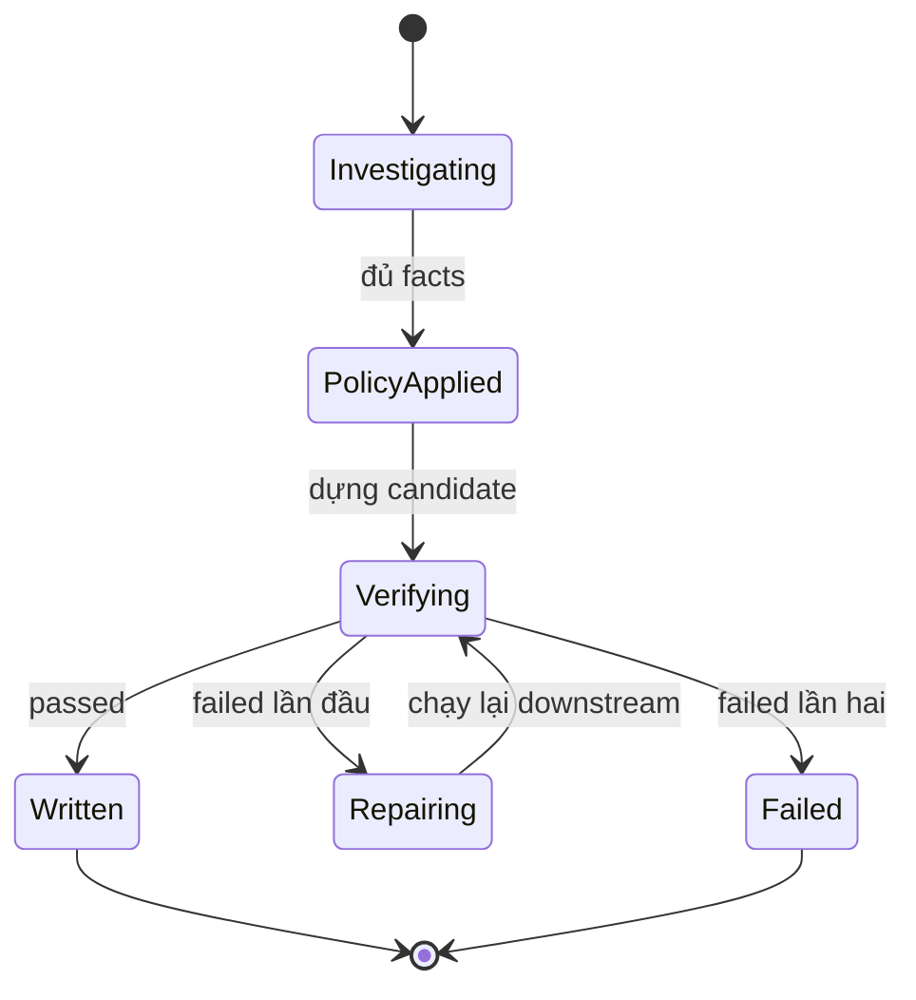

# Thiết kế kiến trúc Multi-Agent và luồng Handoff

## 1. Mục tiêu

Thiết kế một hệ thống Multi-Agent xử lý lần lượt 50 case khiếu nại thương mại điện tử trên dữ liệu Olist. Với mỗi case, hệ thống phải:

- Thu thập fact từ đúng các bảng CSV liên quan.
- Phân tích độc lập các domain khách hàng, đơn hàng, sản phẩm, giao hàng và thanh toán.
- Áp dụng `EC_POLICY_V2` theo đúng thứ tự ưu tiên.
- Tạo output JSON có thể truy vết về dữ liệu nguồn.
- Kiểm chứng schema, phép tính, evidence và giới hạn trước khi ghi file.

Kiến trúc sử dụng cách tiếp cận **agent-orchestrated, deterministic-first**: agent chịu trách nhiệm điều tra từng domain và thực hiện handoff; các phép join, tính tiền, tính thời gian, áp dụng policy và kiểm tra output được thực hiện bằng tool Python xác định.

## 2. Nguyên tắc thiết kế

### 2.1 Đồ thị cố định thay vì điều phối tự do

Cả 50 input có cùng schema và cùng policy, vì vậy Coordinator chạy một đồ thị đã xác định trước. Không dùng LLM để tự quyết định bỏ qua agent hoặc thay đổi thứ tự nghiệp vụ.

### 2.2 Agent tách theo domain

Mỗi agent có:

- Một trách nhiệm chuyên môn duy nhất.
- Một tập tool được phép sử dụng.
- Một schema input và output riêng.
- Một namespace riêng trong state.
- Trace event cho lúc bắt đầu, hoàn thành, lỗi và handoff.

### 2.3 Handoff có kiểu dữ liệu

Agent không bàn giao kết quả bằng văn bản tự do. Mọi handoff là object được validate bằng Pydantic hoặc JSON Schema trước khi agent tiếp theo sử dụng.

### 2.4 Nguồn dữ liệu là sự thật

- Không tạo transaction ID, refund ledger hoặc tracking checkpoint không tồn tại.
- Không dùng nội dung khiếu nại để ghi đè fact trong CSV.
- Evidence ID chỉ được tạo từ record nguồn hoặc root-cause code hợp lệ.
- LLM không được tự tính số tiền, số giờ hoặc tự tạo ID.

### 2.5 Không gọi agent trực tiếp

Các agent không gọi lẫn nhau. Agent tạo result vào graph state; Coordinator kiểm tra result rồi mở khóa node tiêu thụ tiếp theo. Cách này giúp kiểm soát dependency, retry và trace.

## 3. Các thành phần kiến trúc

| Thành phần | Loại | Trách nhiệm chính |
| --- | --- | --- |
| Input Validator | Module xác định | Đọc input, kiểm tra schema, `case_id`, order ID và policy version |
| Coordinator Agent | Agent điều phối | Dispatch agent, quản lý state, dependency, retry và trạng thái case |
| Customer Agent | Specialist agent | Xác định khách hàng và lịch sử order |
| Order & Product Agent | Specialist agent | Thu thập order, item, seller, product, category và dữ liệu nền |
| Delivery Agent | Specialist agent | Tính delivery variance và seller handoff variance |
| Payment Agent | Specialist agent | Tổng hợp payment, item/freight và đối soát số tiền |
| Policy Agent | Decision agent | Áp dụng `EC_POLICY_V2`, chọn issue, trách nhiệm, refund và actions |
| Result Assembler | Module xác định | Ghép specialist results và policy decision thành candidate output |
| Verifier Agent | Assurance agent | Kiểm tra độc lập schema, nguồn, công thức, evidence và invariant |
| Output Writer | Module xác định | Ghi JSON nguyên tử sau khi Verifier cho phép |
| Trace Sink | Module hạ tầng | Ghi trace JSONL của các agent và handoff |
| Olist Repository | Data access layer | Nạp CSV một lần, lập index và cung cấp query chỉ đọc |

Input Validator, Result Assembler, Output Writer, Trace Sink và Olist Repository không được đặt tên thành agent. Chúng là các module hạ tầng xác định hỗ trợ hệ thống agent.

## 4. Sơ đồ kiến trúc



### Dependency chính

- Customer Agent và Order & Product Agent chạy song song sau khi input hợp lệ.
- Delivery Agent và Payment Agent chỉ chạy khi Order & Product Agent đã bàn giao dữ liệu nền.
- Delivery và Payment chạy song song với nhau.
- Policy Agent chỉ chạy khi đủ bốn specialist result hợp lệ.
- Output Writer chỉ chạy khi Verifier trả `passed`.

## 5. Vai trò và ranh giới từng agent

### 5.1 Coordinator Agent

**Nhận**

- Input case đã validate.
- Result hoặc error từ các agent.
- Validation report từ Verifier.

**Thực hiện**

- Tạo `InvestigationTask`.
- Kích hoạt node đúng dependency.
- Chờ đủ result cần thiết.
- Tạo `FactBundle` bất biến.
- Route lỗi verification về agent sở hữu field.
- Chạy lại các node downstream sau repair.

**Không thực hiện**

- Không query CSV để tự điều tra.
- Không tính tiền hoặc thời gian.
- Không áp dụng policy.
- Không sửa result của specialist.
- Không ghi output khi chưa có validation token.

### 5.2 Customer Agent

**Tool được phép dùng**

```text
get_customer_for_order(order_id)
get_orders_by_customer_unique_id(customer_unique_id)
```

**Đầu ra**

- `customer_unique_id`.
- `related_order_ids`, loại order đang điều tra và tối đa 5 phần tử khi xuất final.
- Fact `repeat_customer`, tính trên toàn bộ lịch sử trước khi giới hạn mảng.

Customer Agent không đưa order lịch sử vào `affected_entities`.

### 5.3 Order & Product Agent

**Tool được phép dùng**

```text
get_order(order_id)
get_items(order_id)
get_products(product_ids)
get_sellers(seller_ids)
```

**Đầu ra**

- Order status và timestamp nguồn.
- Item, seller, product và category theo thứ tự ổn định.
- Các fact `multi_item_order`, `multi_seller_order`, `multiple_categories`.
- `OrderFinancialBasis` cho Payment Agent.
- `DeliveryBasis` cho Delivery Agent.
- Các source ID phục vụ Result Assembler tạo evidence.

Nếu không có item row, các mảng item, seller, product, category và financial item phải rỗng. Agent không tự tạo item hoặc seller thay thế.

### 5.4 Delivery Agent

**Nhận:** `DeliveryBasis` đã validate.

**Thực hiện**

```text
delivery_variance_hours
  = delivered_at - estimated_delivery_at

handoff_variance_hours của seller
  = carrier_handoff_at - shipping_limit_at sớm nhất của seller
```

**Đầu ra**

- `delivery_analysis`.
- `is_late_delivery`.
- `late_handoff_seller_ids`.
- Fact để Policy Agent phân biệt seller delay, logistics delay và giao đúng hạn.

Agent không đổi timezone. Khi thiếu timestamp cần thiết, variance tương ứng là `null`.

### 5.5 Payment Agent

**Nhận:** `OrderFinancialBasis` đã validate.

**Tool được phép dùng**

```text
get_payments(order_id)
```

**Thực hiện**

```text
item_total_brl     = sum(item.price)
freight_total_brl  = sum(item.freight_value)
expected_total_brl = item_total_brl + freight_total_brl
payment_total_brl  = sum(payment.payment_value)
difference_brl     = payment_total_brl - expected_total_brl
reconciled         = abs(difference_brl) <= 0.10
```

**Đầu ra**

- `payment_reconciliation`.
- Payment IDs theo thứ tự nguồn.
- Payment types theo lần xuất hiện đầu tiên.
- Fact `split_payment` dựa trên số payment row.

Mọi phép tính dùng `Decimal`. Không nhân `payment_value` với số installment. Nếu order không có item, `expected_total_brl`, `difference_brl` và `reconciled` là `null`.

### 5.6 Policy Agent

**Nhận:** `FactBundle` bất biến.

**Không được đọc:** CSV hoặc nội dung handoff chưa validate.

**Thực hiện**

- Chọn primary issue theo thứ tự `EC_POLICY_V2` và dừng tại rule đầu tiên khớp.
- Sắp xếp secondary issues theo thứ tự policy.
- Xác định root cause và responsible parties.
- Tính refund từ số liệu Payment Agent đã cung cấp.
- Sinh resolution actions theo thứ tự quy định.

Policy Agent không tạo evidence ID và không sửa fact của specialist. Nếu không rule nào khớp, trả lỗi `UNCLASSIFIED_CASE` thay vì tạo taxonomy mới.

### 5.7 Verifier Agent

**Nhận**

- Candidate output đầy đủ.
- Input case.
- Quyền đọc Olist Repository và policy module để kiểm tra độc lập.

**Kiểm tra**

- Output schema và kiểu dữ liệu.
- Primary/secondary issue và thứ tự policy.
- Tiền, thời gian và quy tắc làm tròn.
- Null handling.
- Quan hệ giữa status, refund, responsible party và action.
- Evidence ID đúng định dạng và tồn tại.
- Thứ tự và giới hạn mảng.
- Không có order lịch sử trong `affected_entities`.

Verifier không sửa candidate. Nó trả lỗi có `path`, `code` và `owner` để Coordinator route repair.

## 6. Graph state

State của một case có cấu trúc logic:

```json
{
  "task": {},
  "customer_result": null,
  "order_product_result": null,
  "payment_result": null,
  "delivery_result": null,
  "fact_bundle": null,
  "policy_result": null,
  "candidate_output": null,
  "validation_report": null,
  "retry_count_by_agent": {},
  "case_status": "input_validated",
  "errors": []
}
```

Mỗi agent chỉ được ghi vào field result của mình. Coordinator là thành phần duy nhất thay đổi `case_status` và retry counter.

## 7. Hợp đồng handoff

### 7.1 Envelope chung

```json
{
  "schema_version": "1.0",
  "case_id": "EC_001",
  "producer": "order_product_agent",
  "consumer": "payment_agent",
  "status": "success",
  "data": {},
  "warnings": [],
  "errors": []
}
```

Quy tắc:

- `case_id` phải khớp task hiện tại.
- `producer` và `consumer` phải thuộc route được cho phép.
- `data` phải qua schema validation trước khi ghi vào state.
- `status = failed` thì `data` không được sử dụng.
- Warning không được dùng để che lỗi thiếu fact quyết định.

### 7.2 Coordinator → Specialist: InvestigationTask

```json
{
  "case_id": "EC_001",
  "claimed_order_id": "<order_id>",
  "investigation_scope": {
    "include_customer_history": true,
    "include_product_context": true
  },
  "policy_version": "EC_POLICY_V2"
}
```

### 7.3 Order & Product → Payment: OrderFinancialBasis

```json
{
  "order_id": "<order_id>",
  "has_items": true,
  "financial_items": [
    {
      "order_item_id": 1,
      "price_brl": "194.00",
      "freight_brl": "18.27"
    }
  ]
}
```

Payment Agent tự tính tổng từ các row đã bàn giao. Handoff dùng chuỗi decimal để tránh sai số do JSON float.

### 7.4 Order & Product → Delivery: DeliveryBasis

```json
{
  "order_id": "<order_id>",
  "delivered_at": "2018-03-31 15:23:33",
  "estimated_delivery_at": "2018-03-28 00:00:00",
  "carrier_handoff_at": "2018-03-15 21:33:51",
  "seller_shipping_limits": [
    {
      "seller_id": "<seller_id>",
      "shipping_limit_at": "2018-03-15 20:31:15"
    }
  ]
}
```

Mỗi seller chỉ xuất hiện một lần; `shipping_limit_at` là `shipping_limit_date` sớm nhất trong các item của seller đó.

### 7.5 Specialist → Policy: FactBundle

```json
{
  "case_id": "EC_001",
  "customer_result": {},
  "order_product_result": {},
  "payment_result": {},
  "delivery_result": {}
}
```

Coordinator chỉ tạo FactBundle khi cả bốn result có `status = success`. FactBundle được đóng băng sau khi validate để Policy Agent không thể sửa fact.

### 7.6 Policy → Result Assembler: PolicyResult

```json
{
  "primary_issue": "late_delivery_seller",
  "secondary_issues": ["multi_item_order", "split_payment"],
  "case_status": "action_required",
  "ranked_causes": [
    {"cause_code": "SELLER_HANDOFF_AFTER_LIMIT", "rank": 1}
  ],
  "responsible_parties": [
    {"party_type": "seller", "party_id": "<seller_id>"}
  ],
  "recommended_refund_brl": "18.27",
  "resolution_actions": [
    "refund_freight",
    "review_seller_handoff",
    "verify_payment_allocation"
  ]
}
```

Result Assembler kết hợp PolicyResult với specialist results để dựng output và evidence IDs. Nó không chạy lại policy.

### 7.7 Verifier → Coordinator/Writer: ValidationReport

```json
{
  "case_id": "EC_001",
  "status": "failed",
  "errors": [
    {
      "code": "PAYMENT_TOTAL_MISMATCH",
      "path": "payment_reconciliation.payment_total_brl",
      "owner": "payment_agent",
      "message": "Không khớp tổng payment row nguồn"
    }
  ],
  "warnings": []
}
```

- `passed`: candidate được chuyển nguyên trạng cho Output Writer.
- `failed`: Coordinator chỉ retry agent được ghi tại `owner`, rồi chạy lại các node downstream.

## 8. Ma trận quyền truy cập

| Thành phần | Được đọc | Được ghi |
| --- | --- | --- |
| Coordinator | Task và toàn bộ graph state | Trạng thái điều phối, retry và errors |
| Customer Agent | `orders`, `customers` qua repository | `customer_result` |
| Order & Product Agent | `orders`, `order_items`, `products`, `sellers` | `order_product_result` |
| Payment Agent | `order_payments`, `OrderFinancialBasis` | `payment_result` |
| Delivery Agent | `DeliveryBasis` | `delivery_result` |
| Policy Agent | FactBundle, `EC_POLICY_V2` | `policy_result` |
| Result Assembler | Các result đã validate | `candidate_output` |
| Verifier Agent | Candidate, input, repository và policy chỉ đọc | `validation_report` |
| Output Writer | Candidate có validation token | `output/EC_xxx.json` |
| Trace Sink | Event đã lọc | `trace.jsonl` |

Không agent nào có quyền ghi CSV. Chỉ Output Writer được ghi vào `output/`.

## 9. Luồng thực thi một case

1. Input Validator đọc `EC_xxx.json` và kiểm tra schema.
2. Coordinator tạo InvestigationTask.
3. Coordinator dispatch Customer Agent và Order & Product Agent song song.
4. Order & Product Agent trả result, OrderFinancialBasis và DeliveryBasis.
5. Coordinator dispatch Payment Agent và Delivery Agent song song.
6. Coordinator chờ đủ bốn specialist result và tạo FactBundle.
7. Policy Agent áp dụng `EC_POLICY_V2`.
8. Result Assembler dựng candidate output và evidence ID.
9. Verifier kiểm tra candidate độc lập.
10. Nếu pass, Output Writer ghi file; nếu fail lần đầu, Coordinator repair đúng owner rồi chạy lại downstream.
11. Nếu vẫn fail sau một lần repair, case chuyển `failed` và batch không được đóng gói.

## 10. Retry và phục hồi lỗi



| Mã lỗi | Owner được retry | Node phải chạy lại sau repair |
| --- | --- | --- |
| `CUSTOMER_HISTORY_MISMATCH` | Customer Agent | Policy → Assembler → Verifier |
| `ENTITY_OR_PRODUCT_MISMATCH` | Order & Product Agent | Payment + Delivery → Policy → Assembler → Verifier |
| `PAYMENT_TOTAL_MISMATCH` | Payment Agent | Policy → Assembler → Verifier |
| `DELIVERY_VARIANCE_MISMATCH` | Delivery Agent | Policy → Assembler → Verifier |
| `POLICY_PRIORITY_MISMATCH` | Policy Agent | Assembler → Verifier |
| `EVIDENCE_OR_SCHEMA_ERROR` | Result Assembler | Verifier |

Không retry toàn bộ graph khi chỉ một domain sai. Retry tối đa một lần cho mỗi case để tránh vòng lặp vô hạn.

## 11. Trace handoff

Mỗi agent phát tối thiểu bốn loại event:

```text
agent_started
tool_completed
handoff_completed
agent_failed hoặc agent_completed
```

Ví dụ một dòng `trace.jsonl`:

```json
{
  "run_id": "<run_id>",
  "case_id": "EC_001",
  "agent": "delivery_agent",
  "event": "handoff_completed",
  "status": "success",
  "input_from": "order_product_agent",
  "output_to": "coordinator_agent",
  "duration_ms": 12,
  "retry": 0,
  "summary": {
    "delivery_variance_hours": 87.39,
    "late_handoff_seller_count": 1
  }
}
```

Trace chỉ lưu tóm tắt cần thiết để chứng minh hoạt động độc lập của agent và handoff. Không ghi secret hoặc toàn bộ CSV row.

## 12. Ranh giới sử dụng model

- Mọi model phải có tối đa 10B parameters.
- Mỗi agent có prompt, tool whitelist và output schema riêng nếu sử dụng LLM.
- Temperature thấp hoặc 0 và bắt buộc structured output.
- Không gửi toàn bộ CSV vào prompt; agent truy xuất bằng tool theo order ID.
- Model không tính toán số tiền/thời gian và không tạo evidence ID.
- Tool output là nguồn sự thật; Result Assembler không nhận text tự do từ model.

Do dữ liệu và policy đều có cấu trúc, các node quyết định quan trọng nên dùng code xác định. LLM chỉ hỗ trợ lập kế hoạch gọi tool hoặc diễn giải trạng thái nội bộ nếu framework yêu cầu.

## 13. Cấu trúc module đề xuất

```text
src/
├── graph.py
├── state.py
├── agents/
│   ├── coordinator.py
│   ├── customer.py
│   ├── order_product.py
│   ├── payment.py
│   ├── delivery.py
│   ├── policy.py
│   └── verifier.py
├── schemas/
│   ├── task.py
│   ├── handoff.py
│   ├── results.py
│   └── output.py
├── repositories/
│   └── olist_repository.py
├── policies/
│   └── ec_policy_v2.py
├── tools/
│   ├── money.py
│   ├── time_analysis.py
│   └── evidence.py
├── assembler.py
├── writer.py
└── trace.py
```

## 14. Kết luận

Luồng tin cậy của hệ thống là:

```text
Input
→ specialist agents tạo fact theo domain
→ Coordinator tạo FactBundle bất biến
→ Policy Agent đưa ra quyết định
→ Result Assembler dựng candidate
→ Verifier đối chiếu lại dữ liệu và policy
→ Output Writer ghi JSON đã được phép
```

Thiết kế này thể hiện multi-agent thực chất thông qua agent độc lập, tool riêng, handoff có schema, fan-out/fan-in, verification và retry có định tuyến. Đồng thời, nó giữ toàn bộ phép tính và policy ở dạng có thể kiểm thử để giảm tối đa hallucination và lỗi chấm tự động.
